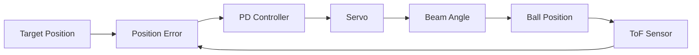
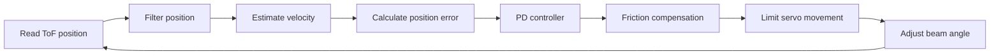

# ESP32 Ball-and-Beam Control System

A low-cost physical feedback-control project built around an ESP32-C3, VL53L4CD time-of-flight sensor and MG996R servo.  
The system measures the position of a ping-pong ball and adjusts the beam angle using an experimentally tuned PD controller, with additional filtering and friction compensation developed through physical testing.

<p align="center">
  
</p>

## Demonstration

The controller was tested from multiple starting positions and setpoints, with the beam automatically adjusting to bring the ball towards the commanded position.

**Closed-loop position control:**  
[▶ Watch demonstration](media/demo_videos/demo_185mm_1.mp4)

**Full-length demonstration:**  
[▶ Watch demonstration](media/demo_videos/full_length_best.mp4)

> The VL53L4CD could not reliably track the ping-pong ball across the full beam. For the full-length demonstration, an initial open-loop motion brings the ball into the reliable sensing region before control is handed over to the PD controller.

## Overview

The aim of this project was to produce a low-cost physical control system that combined mechanical design, electronics and feedback control into a single working prototype.

A ping-pong ball rolls along a ~700 mm V-shaped beam whose angle is controlled by an MG996R servo through a custom linkage. A VL53L4CD time-of-flight sensor measures the ball position and sends this to an ESP32-C3, which calculates the position error and continuously adjusts the beam angle using a PD controller. The project was developed experimentally: the mechanical geometry, sensor mounting and controller parameters were all modified based on the behaviour of the real system rather than relying only on a theoretical model.

## System Design

| Subsystem | Implementation |
| --- | --- |
| **Controller** | ESP32-C3 running the control loop in C++ |
| **Position sensing** | VL53L4CD time-of-flight sensor mounted at one end of the beam |
| **Actuation** | MG996R servo connected to the beam through a custom wooden linkage |
| **Servo power** | External 5 V supply with a common ground to the ESP32 and bulk capacitor across the servo supply |
| **Mechanical system** | ~700 mm V-shaped beam mounted on a central pivot |
| **Control** | PD position control with sensor filtering, static-friction compensation and servo slew limiting |

### Feedback Loop



The proportional term drives the ball towards the target, while the derivative term provides damping based on the estimated ball velocity. More logic was introduced during testing to deal with sensor noise, friction and sudden servo movements.

## Development & Engineering Challenges

The final system was reached through several mechanical, electrical and control iterations. The most useful changes came from testing the real behaviour of the mechanism and then modifying the design around the limitations that appeared.

### 1. Reducing the load on the servo

The first mechanical arrangement placed too much load on the servo and made the beam difficult to move smoothly. The pivot was moved closer to the centre of the beam, reducing the moment created by the beam's weight and therefore reducing the torque required from the servo.

The moving beam holder was also reduced to approximately 70 g, helping the actuator respond more easily to small control inputs.

<p align="center">
  
</p>

### 2. Developing a reliable servo linkage

The servo linkage had several iterations. Parts from an unused camera stand were repurposed during prototyping to create elements of the linkage and beam support, allowing the geometry to be tested and modified quickly without fabricating every component from scratch. Early versions suffered from poor clearance, movement in the servo mounting block and difficulty attaching the linkage securely to the servo horn.

The final mechanism used a rigid wooden linkage with rotating joints at both ends. The servo horn was drilled to help to attach to the linkage, while the servo mounting block was fixed more securely to the base to reduce unwanted movement.

<p align="center">
  
  
</p>

### 3. Supplying the servo independently

The MG996R servo was powered from a separate 5 V supply rather than directly from the ESP32. The servo can draw relatively large transient currents, which could otherwise cause voltage drops or reset the microcontroller.

The external supply shared a common ground with the ESP32, and a large electrolytic capacitor was added across the servo supply to help absorb short current spikes during sudden movements.

<p align="center">
  
</p>

### 4. Sensor alignment and calibration

The VL53L4CD was mounted at one end of the beam and initially appeared suitable for measuring the ball across the full track. In practice, the small ping-pong ball became difficult to detect reliably at longer distances because it occupied only a small part of the sensor's field of view.

Sensor alignment was adjusted and the useful operating region was characterised experimentally. Physical ball position was then compared against the raw sensor measurement:

| Physical distance (mm) | Sensor reading (mm) |
| ---: | ---: |
| 20 | 30 |
| 50 | 62 |
| 100 | 117.5 |
| 110 | 126 |
| 150 | 162 |
| 200 | 187.5 |

This calibration was used when selecting controller setpoints rather than assuming that the sensor reading represented the exact physical ball position.

<p align="center">
  
</p>

### 5. Overcoming friction and mechanical dead-zone

Testing around the level position showed that small changes in beam angle did not always cause the ball to move. The ball reliably rolled towards the sensor at approximately 104° and away from it at around 116°, while behaviour closer to the level angle was inconsistent due to static friction, small track imperfections and linkage movements.

A minimum control correction was therefore added when the ball was nearly stationary but still significantly away from the target. This provided enough beam angle to overcome static friction without continuously applying the same large correction near the setpoint.

### 6. Tuning the feedback controller

Early proportional-control tests were either too weak to move the ball effectively or produced large overshoot. Adding derivative feedback improved damping, but an unfiltered velocity estimate caused the servo and linkage to twitch.

The final controller therefore combined:

- proportional position feedback;
- derivative damping based on estimated ball velocity;
- low-pass filtering of position and velocity;
- static-friction compensation;
- a position deadband near the setpoint;
- servo slew-rate limiting to reduce sudden mechanical movements.

These changes were tuned experimentally until the system could repeatedly move the ball towards the commanded position and settle close to the target.

<p align="center">
  
</p>

An earlier PD tuning run showed the effect of insufficient damping, with the ball repeatedly oscillating around the target before gradually settling. Later tuning reduced this behaviour and produced a faster, more controlled response.

[▶ Watch early oscillatory controller response](media/demo_videos/early_pd_oscillation.mp4)

## Control System

The controller runs on the ESP32 and repeatedly reads the ball position from the VL53L4CD, compares it with the desired setpoint, and adjusts the servo angle.

The basic control law is:

\[
u = K_p e - K_d v
\]

where:

- \(e\) is the position error: `target - measured position`
- \(v\) is the estimated ball velocity
- \(K_p\) determines how strongly the system reacts to position error
- \(K_d\) provides damping by opposing rapid ball motion

For the final tuned controller:

```cpp
Kp = 0.065;
Kd = 0.020;
```

### Position and velocity filtering

The raw ToF measurement contains many fluctuations which become much more significant when velocity was calculated from consecutive readings. Low-pass filtering was therefore applied to both position and velocity:

```cpp
filteredDistance =
    DIST_ALPHA * rawDistance +
    (1.0 - DIST_ALPHA) * filteredDistance;

velocity =
    VEL_ALPHA * rawVelocity +
    (1.0 - VEL_ALPHA) * velocity;
```

This reduced servo twitching while retaining enough response speed for the controller to react to the moving ball.

### Static-friction compensation

One limitation of the physical mechanism was that very small beam-angle corrections were sometimes insufficient to start the ball moving. Rather than increasing the proportional gain everywhere, a minimum correction was applied only when the ball was moving slowly and remained sufficiently far from the target:

```cpp
if (abs(velocity) < 5.0 && abs(error) > 10.0) {
    if (correction > 0 && correction < MIN_CORRECTION)
        correction = MIN_CORRECTION;

    if (correction < 0 && correction > -MIN_CORRECTION)
        correction = -MIN_CORRECTION;
}
```

This worked really well in allowing the controller to overcome static friction without continuously applying large corrections around the setpoint.

### Servo slew limiting

Rapid servo changes caused the lightweight beam and linkage to bounce during early tests. The commanded servo position was therefore limited to a maximum change of approximately 1.2° per control update. This made the servo motion much smoother and reduced mechanical disturbances that could otherwise affect the balls motion.

### Control sequence


## Results

The final system was able to repeatedly move the ball towards commanded positions from different starting points and settle close to the target.

During tuning with a target sensor reading of 126 mm, successful runs settled at approximately 124 mm and 119 mm. The controller was also tested at a higher setpoint of approximately 185 mm, demonstrating that the same control approach could control the ball along dfferent parts of the usable sensing region.

### Closed-loop demonstrations

**Target ≈ 126 mm** 

[▶ Watch demonstration](media/demo_videos/demo_126mm.mp4)

**Target ≈ 185 mm**

[▶ Watch demonstration 1](media/demo_videos/demo_185mm_1.mp4)  
[▶ Watch demonstration 2](media/demo_videos/demo_185mm_2.mp4)

### Disturbance recovery

The ball was also manually displaced after the controller had stabilised it. The system detected the resulting position error and adjusted the beam to move the ball back towards the commanded position.

[▶ Watch disturbance recovery 1](media/demo_videos/disturbance_recovery_1.mp4)  
[▶ Watch disturbance recovery 2](media/demo_videos/disturbance_recovery_2.mp4)

### Full-length demonstration

The physical beam is approximately 700 mm long, but the VL53L4CD could not reliably detect the ping-pong ball across that entire distance.

To demonstrate motion across the full beam without hiding this limitation, a two-stage control sequence was implemented:

1. Open-loop — a short predefined beam motion brings the ball towards the sensor.
2. Closed-loop regulation — once inside the reliable sensing region, the controller resets its position and velocity estimates and hands control over to the PD algorithm.

[▶ Watch full-length demonstration](media/demo_videos/full_length_best.mp4)

This approach allowed the complete mechanical travel of the system to be demonstrated while keeping the actual feedback-controlled region within the sensor's reliable operating range.

## Limitations & Future Improvements

The main limitation of the prototype was the position sensor. Although the beam was approximately 700 mm long, the VL53L4CD could only measure the small ping-pong ball reliably over part of that distance (approx 220mm). This limited the closed-loop operating region and required extra open-loop estimation for the full-length demonstration.

Further improvements could include:

- replacing the end-mounted ToF sensor with an overhead vision system, or a narrower-field LiDAR sensor, to track the ball reliably across the full ~700 mm beam;
- using a more rigid, accurately manufactured beam and linkage;
- reducing friction and movement in the pivot and linkage joints;
- collecting position data directly to a file for more systematic controller tuning;
- investigating integral control or more advanced control methods once the mechanical system is made more repeatable.

## What I Learned

The project highlighted the importance of the iterative process having to repeatedly test the system, identify the main limitation, making one change, then observing how that change affected the response. This is very different compared to designing a controller in theory, here small effects such as sensor alignment, servo power stability, linkage geometry, friction and structural movement have a significant impact on control performance. Improving the system therefore required working across mechanical design, electronics and software, rather than treating the controller as an isolated problem.

## Hardware

| Component | Role |
| --- | --- |
| **ESP32-C3** | Runs the sensor interface and control algorithm |
| **VL53L4CD ToF sensor** | Measures ball position along the beam |
| **MG996R servo** | Adjusts the beam angle through the mechanical linkage |
| **5 V external power supply** | Powers the servo independently from the ESP32 |
| **Electrolytic capacitor** | Helps stabilise the servo supply during rapid current changes |
| **Ping-pong ball** | Controlled object |
| **Custom beam, pivot and linkage** | Mechanical plant of the control system |

## Repository Structure

```text
ball-and-beam-control/
│
├── firmware/
│   ├── ball_beam_pd_controller/
│   │   └── ball_beam_pd_controller.ino
│   │
│   └── full_length_demo/
│       └── full_length_demo.ino
│
├── data/
│   └── sensor_calibration.csv
│
├── media/
│   ├── building_process/
│   ├── demo_videos/
│   └── final_build_photos/
│
├── LICENSE
└── README.md
```

The main firmware contains the closed-loop PD controller used for normal position-control tests. The full-length demonstration firmware adds an open-loop acquisition stage before handing control back to the PD controller once the ball enters the reliable sensor region.

## Running the Project

The firmware was developed in the **Arduino IDE** for the ESP32-C3.

Required libraries:

```text
ESP32Servo
VL53L4CD
Wire
```

The main connections used were:

```text
VL53L4CD SDA  -> GPIO 1
VL53L4CD SCL  -> GPIO 0
Servo signal  -> GPIO 4
Servo power   -> external 5 V supply
ESP32 GND     -> servo supply GND
```

The servo should be powered from the external supply rather than directly from the ESP32. A common ground is required between the ESP32 and the servo supply.

---

## License

This project is released under the **MIT License**.


